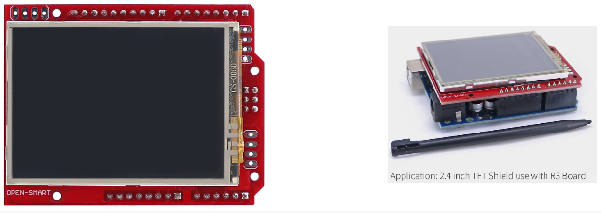
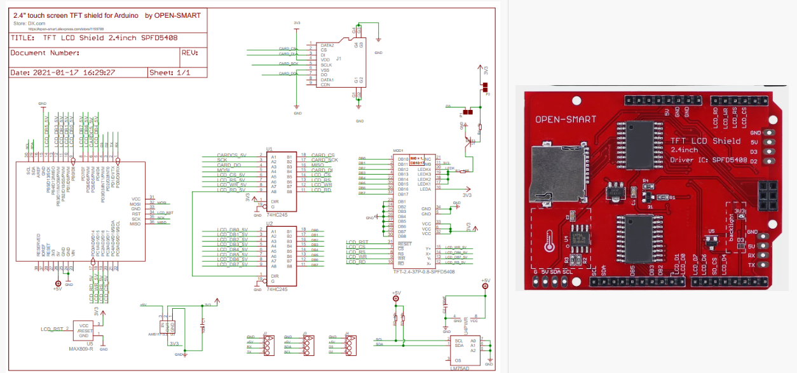

# SPFD5408_2.4_TFT 
Library for 2.4 inch TFT only mcufriend Shields for Arduino Uno 

Based on  [MCUFRIEND_kbv](https://github.com/prenticedavid/MCUFRIEND_kbv)

1. Install "Adafruit_GFX" library.

2. Install "SPFD5408_2.4_TFT" library.

3. Insert your Mcufriend style display shield into UNO.   Only 28-pin shields are supported.

4. Start your Arduino IDE.

5. Build any of the Examples from the File->Examples->SPFD5408_2.4_TFT.  e.g.

| Photo | 
| ------------- | 
|  | 
|  | 